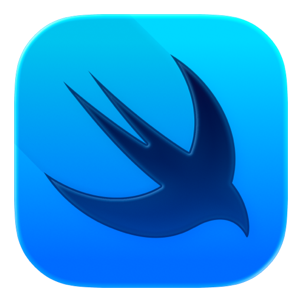

# I'm Bright
Over the years, I have honed my skills in UI/UX and frontend development using technologies such as Flutter for cross-platform development, SwiftUI, JavaScript and ReactJS. I have also worked extensively with NoSQL and SQL databases and APIs, ensuring seamless integration and data management in the applications I build.

--- 

## My Stacks

<!-- 

 -->

## Streak

