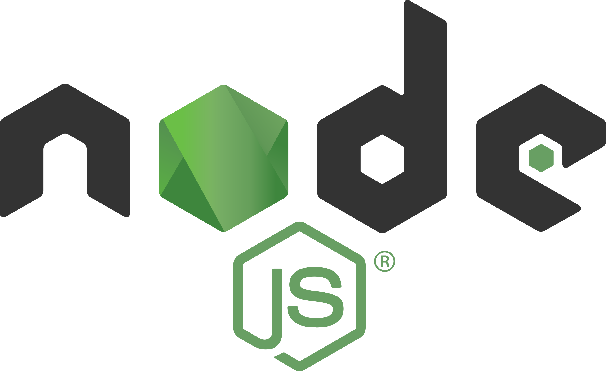

# I'm Bright
Over the years, I have honed my skills in UI/UX and frontend development using technologies such as Flutter for cross-platform development, SwiftUI, JavaScript and ReactJS. I have also worked extensively with NoSQL and SQL databases and APIs, ensuring seamless integration and data management in the applications I build.

--- 

## My Stacks

<table >
  <tr>
    <td >
      
    </td>
    <td></td>
    <td >
      
    </td>
    <td></td>
    <td >
      
    </td>
    <td></td>
    <td >
      
    </td>
    <td></td>
    <td >
      
    </td>
    <td></td>
    <td >
      
    </td>
    <td></td>
    <td >
      
    </td>
    <td></td>
    <td >
      
    </td>
  </tr>
    <tr>
    <td >
      Flutter
    </td>
    <td></td>
    <td >
      Dart
    </td>
    <td></td>
    <td >
      SwiftUI
    </td>
    <td></td>
    <td >
      Firebase
    </td>
    <td></td>
    <td >
      SQL
    </td>
    <td></td>
    <td >
      Figma
    </td>
    <td></td>
    <td >
      Node.js
    </td>
    <td></td>
    <td >
      Git
    </td>
  </tr>
</table>

<!-- 

 -->

## Streak

